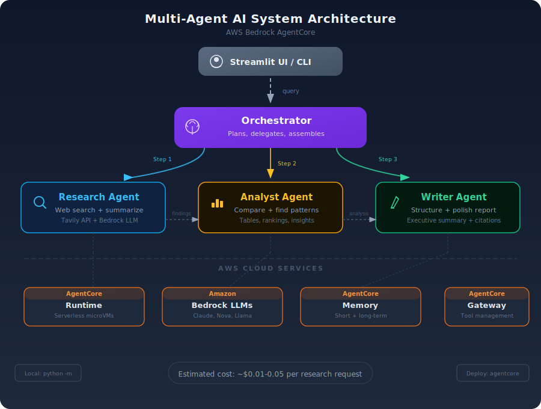

<div align="center">

# Multi-Agent AI App on AWS

### Build and deploy a production-ready multi-agent system on AWS using Bedrock AgentCore

**3 specialized AI agents + 1 orchestrator = Your AI research team**

[](https://python.org)
[](https://aws.amazon.com/bedrock/agentcore/)
[](LICENSE)
[](#architecture)

</div>

---

## What You'll Build

A multi-agent system where 4 AI agents collaborate to research any topic and produce a comprehensive report:

| Agent | Role | What It Does |
|-------|------|-------------|
| **Orchestrator** | Supervisor | Breaks down your request, delegates to specialists, assembles final output |
| **Research Agent** | Web Researcher | Searches the web, gathers sources, summarizes findings |
| **Analyst Agent** | Data Analyst | Analyzes research data, identifies patterns, computes comparisons |
| **Writer Agent** | Report Writer | Takes research + analysis and produces a polished, structured report |

**Example prompt:**
> "Research the current state of AI agents in enterprise. Compare top frameworks (LangGraph, CrewAI, AutoGen, Strands). Include adoption trends and pricing."

**What you get:** A structured report with sourced research, comparative analysis, and actionable recommendations - all produced by collaborating agents.

---

## Architecture

<div align="center">

</div>

**AWS Services Used:**
- **Bedrock AgentCore Runtime** - Serverless agent hosting (auto-scales, per-second billing)
- **Amazon Bedrock** - Foundation models (Claude Sonnet 4)
- **AgentCore Memory** - Conversation history + long-term memory
- **AgentCore Gateway** - Tool management (web search, calculator)
- **IAM** - Permissions and security

**Estimated Cost:** ~$0.01-0.05 per research request (mostly LLM token costs)

---

## Prerequisites Setup (Do This First)

> **Already have Python 3.10+, uv, AWS CLI, and configured credentials?** Skip to [Quick Start](#quick-start-local-development).

Follow each step below. By the end, you'll have everything needed to run the project.

### Step 1: Install Python 3.10+

**Check if you already have it:**
```bash
python --version
# or
python3 --version
```

If you see `Python 3.10.x` or higher, skip to Step 2.

**Install Python:**
1. Go to [python.org/downloads](https://python.org/downloads)
2. Download the latest Python (3.12+ recommended)
3. **Windows**: Run the installer. **Check "Add Python to PATH"** at the bottom of the first screen before clicking Install
4. **Mac**: Run the `.pkg` installer
5. **Linux**: `sudo apt update && sudo apt install python3 python3-pip` (Ubuntu/Debian) or `sudo dnf install python3` (Fedora)

> **Windows users**: After installing, close and reopen your terminal (Command Prompt or PowerShell) for `python` to be recognized.

**Verify:**
```bash
python --version   # Should show Python 3.10+
```

### Step 2: Install uv (Fast Python Package Manager)

[uv](https://docs.astral.sh/uv/) is a blazing-fast Python package manager written in Rust. It replaces `pip` and `venv` with a single tool.

```bash
# Windows (PowerShell)
powershell -ExecutionPolicy ByPass -c "irm https://astral.sh/uv/install.ps1 | iex"

# Mac / Linux
curl -LsSf https://astral.sh/uv/install.sh | sh

# Or with pip (any platform)
pip install uv
```

**Verify:**
```bash
uv --version   # Should show uv 0.x.x
```

### Step 3: Install AWS CLI v2

**Check if you already have it:**
```bash
aws --version   # Should show aws-cli/2.x.x
```

If you see version 2.x, skip to Step 4.

**Install AWS CLI v2:**
- **Windows**: Download and run [AWSCLIV2.msi](https://awscli.amazonaws.com/AWSCLIV2.msi). After installing, close and reopen your terminal.
- **Mac**: Download and run [AWSCLIV2.pkg](https://awscli.amazonaws.com/AWSCLIV2.pkg)
- **Linux**:
  ```bash
  curl "https://awscli.amazonaws.com/awscli-exe-linux-x86_64.zip" -o "awscliv2.zip"
  unzip awscliv2.zip
  sudo ./aws/install
  ```

**Verify:**
```bash
aws --version   # Should show aws-cli/2.x.x
```

### Step 4: Create an AWS Account (Skip If You Already Have One)

1. Go to [aws.amazon.com/free](https://aws.amazon.com/free) and click **"Create a Free Account"**
2. Enter your email, choose an account name, and verify your email
3. Choose **"Personal"** account type
4. Enter your payment details (required, but Free Tier won't charge you for small usage)
5. Complete phone verification
6. Select the **"Basic Support - Free"** plan
7. Sign in to the [AWS Console](https://console.aws.amazon.com/) with your new account

### Step 5: Create an IAM User and Get Access Keys

Your AWS account has a "root" login, but for security you should create a separate IAM user for programmatic access.

1. Sign in to [AWS Console](https://console.aws.amazon.com/)
2. Go to **IAM** (search "IAM" in the top search bar)
3. Click **"Users"** in the left sidebar, then **"Create user"**
4. **User name**: `bedrock-agent-user` (or any name you prefer)
5. Click **"Next"**
6. Select **"Attach policies directly"**
7. Search and check these two policies:
   - `AmazonBedrockFullAccess`
   - `IAMFullAccess` (needed for AgentCore deployment only, skip if just running locally)
8. Click **"Next"**, then **"Create user"**
9. Click on the user you just created
10. Go to the **"Security credentials"** tab
11. Scroll down to **"Access keys"**, click **"Create access key"**
12. Select **"Command Line Interface (CLI)"**
13. Check the confirmation box, click **"Next"**, then **"Create access key"**
14. **Save both keys now** - you won't be able to see the Secret Access Key again:
    - `Access key ID` (looks like: `AKIA...`)
    - `Secret access key` (looks like: `wJalrXUtnF...`)

### Step 6: Configure AWS CLI

```bash
aws configure
```

It will ask for 4 values. Enter them one at a time:

```
AWS Access Key ID [None]: AKIA...YOUR_ACCESS_KEY...
AWS Secret Access Key [None]: wJalrXUtnF...YOUR_SECRET_KEY...
Default region name [None]: us-east-1
Default output format [None]: json
```

**Verify it works:**
```bash
aws sts get-caller-identity
```

You should see something like:
```json
{
    "UserId": "AIDA...",
    "Account": "123456789012",
    "Arn": "arn:aws:iam::123456789012:user/bedrock-agent-user"
}
```

> If you see an error, double-check your Access Key and Secret Key. The most common mistake is a trailing space when pasting.

### Step 7: Enable Bedrock Models

1. Go to [Amazon Bedrock Model Access](https://us-east-1.console.aws.amazon.com/bedrock/home?region=us-east-1#/modelaccess)
2. Click **"Manage model access"** (or **"Modify model access"**)
3. Find **"Anthropic"** section, check **"Claude Sonnet 4"**
4. Click **"Request model access"** (or **"Save changes"**)
5. Wait for the status to show **"Access granted"** (usually instant)

> **Can't find Claude?** Make sure you're in the **us-east-1** region (check the top-right dropdown in the AWS Console). If Claude is unavailable, you can use **Amazon Nova Lite** instead - it's always available and much cheaper. Just change the model in `.env` later.

> **Don't want AWS billing?** You can skip Steps 4-7 entirely and use **Groq** or **Gemini** instead - both have free tiers. See [Free Alternatives](#free-alternatives-no-aws-needed) below.

---

## Free Alternatives (No AWS Needed)

Don't have an AWS account or want to avoid billing? Use **Groq** or **Gemini** - both have generous free tiers.

### Option A: Groq (Free - Llama 3.3 70B)

1. Go to [console.groq.com/keys](https://console.groq.com/keys) and sign up (Google/GitHub login)
2. Click **"Create API Key"**, copy it
3. Install the Groq package:
   ```bash
   uv pip install groq
   ```
4. Set in your `.env`:
   ```
   LLM_PROVIDER=groq
   GROQ_API_KEY=gsk_your_key_here
   GROQ_MODEL_ID=llama-3.3-70b-versatile
   ```

**Free tier:** 30 requests/minute, 14,400 requests/day. More than enough for testing.

**Available models:** `llama-3.3-70b-versatile` (best), `llama-3.1-8b-instant` (fastest), `gemma2-9b-it`, `mixtral-8x7b-32768`

### Option B: Gemini (Free - Gemini 2.0 Flash)

1. Go to [aistudio.google.com/apikey](https://aistudio.google.com/apikey) and sign in with Google
2. Click **"Create API Key"**, copy it
3. Install the Gemini package:
   ```bash
   uv pip install google-genai
   ```
4. Set in your `.env`:
   ```
   LLM_PROVIDER=gemini
   GEMINI_API_KEY=your_key_here
   GEMINI_MODEL_ID=gemini-2.0-flash
   ```

**Free tier:** 15 requests/minute, 1,500 requests/day. Great for development and testing.

**Available models:** `gemini-2.0-flash` (fast, free), `gemini-2.5-flash` (smarter), `gemini-2.5-pro` (best quality)

### Provider Comparison

| Provider | Cost | Setup Time | Best Model | Quality |
|----------|------|-----------|------------|---------|
| **Groq** | Free | 2 min | Llama 3.3 70B | Good |
| **Gemini** | Free | 2 min | Gemini 2.0 Flash | Good |
| **Bedrock (Nova Lite)** | ~$0.001/request | 15 min | Nova Lite | Good |
| **Bedrock (Claude Sonnet 4)** | ~$0.01-0.04/request | 15 min | Claude Sonnet 4 | Best |

> **Recommendation:** Start with **Groq** (fastest setup, best free model). Switch to **Bedrock + Claude Sonnet 4** when you want production quality.

---

## Quick Start (Local Development)

### Step 1: Clone and Install

```bash
git clone https://github.com/genieincodebottle/multi-agents-app-on-aws.git
cd multi-agents-app-on-aws

# Create virtual environment and install dependencies
uv venv
.venv\Scripts\activate           # Windows
# source .venv/bin/activate      # Mac/Linux

# Install dependencies
uv pip install -r requirements.txt
```

### Step 2: Set Up Environment

```bash
cp .env.example .env
# Edit .env with your preferences (defaults work for most users)
```

### Step 3: Run Locally

```bash
# Option A: Quick test from command line
python -m agents.orchestrator --query "Compare Python vs Rust for AI development"

# Option B: Run the Streamlit UI (web interface)
uv pip install -r ui/requirements.txt
streamlit run ui/app.py
```

> **First run slow?** The first Bedrock API call may take 5-10 seconds (cold start). Subsequent calls are faster.

> **Billing error?** If you see `INVALID_PAYMENT_INSTRUMENT`, add a payment method at [AWS Billing Console](https://console.aws.amazon.com/billing/) and retry after 2 minutes.

### Step 4: Test It

```bash
# Test with a simple query
python -m agents.orchestrator --query "What is machine learning?"

# Use verbose mode to see each agent's output
python -m agents.orchestrator --query "What is machine learning?" --verbose
```

> **Want to save money?** Use Amazon Nova Lite (10x cheaper) by editing `.env`:
> ```
> BEDROCK_MODEL_ID=us.amazon.nova-lite-v1:0
> ```
> Nova Lite works great for testing. Switch to Claude Sonnet for production quality.

---

## Deploy to AWS (AgentCore)

Once you've tested locally, deploy to AWS AgentCore for production use.

### Prerequisites

```bash
# Install AgentCore CLI
uv pip install bedrock-agentcore-starter-toolkit
```

### Option A: One-Command Deploy (Recommended for Beginners)

```bash
# This script deploys all 4 agents to AgentCore
bash scripts/deploy.sh
```

The script will:
1. Configure IAM roles (if not exists)
2. Deploy each agent to AgentCore Runtime
3. Print the endpoint URLs
4. Run a health check

### Option B: Manual Deploy (Step by Step)

```bash
# 1. Deploy Research Agent
cd deploy/agentcore
agentcore configure -e research_agent.py
agentcore launch
# Note the ARN printed - you'll need it

# 2. Deploy Analyst Agent
agentcore configure -e analyst_agent.py
agentcore launch

# 3. Deploy Writer Agent
agentcore configure -e writer_agent.py
agentcore launch

# 4. Deploy Orchestrator (needs other agent ARNs)
# Edit orchestrator.py with the ARNs from steps 1-3
agentcore configure -e orchestrator.py
agentcore launch
```

### Option C: Terraform (Production-Grade)

```bash
cd deploy/terraform

# Initialize Terraform
terraform init

# Preview what will be created
terraform plan -var="aws_region=us-east-1"

# Deploy everything
terraform apply -var="aws_region=us-east-1"

# Get outputs (agent endpoints)
terraform output
```

---

## Configuration

### Environment Variables

| Variable | Default | Description |
|----------|---------|-------------|
| `LLM_PROVIDER` | `bedrock` | LLM provider: `bedrock`, `groq`, or `gemini` |
| `AWS_REGION` | `us-east-1` | AWS region (Bedrock only) |
| `BEDROCK_MODEL_ID` | `us.anthropic.claude-sonnet-4-20250514-v1:0` | Bedrock model ID |
| `GROQ_API_KEY` | (empty) | Groq API key ([console.groq.com/keys](https://console.groq.com/keys)) |
| `GROQ_MODEL_ID` | `llama-3.3-70b-versatile` | Groq model ID |
| `GEMINI_API_KEY` | (empty) | Gemini API key ([aistudio.google.com/apikey](https://aistudio.google.com/apikey)) |
| `GEMINI_MODEL_ID` | `gemini-2.0-flash` | Gemini model ID |
| `TAVILY_API_KEY` | (optional) | Web search API key ([tavily.com](https://tavily.com) - free tier: 1000 searches/month) |
| `LOG_LEVEL` | `INFO` | Logging verbosity (DEBUG, INFO, WARNING, ERROR) |
| `MAX_RESEARCH_RESULTS` | `5` | Number of web search results per query |
| `MAX_AGENT_ITERATIONS` | `10` | Safety limit for agent reasoning loops |
| `AGENTCORE_MEMORY_ID` | (auto-created) | AgentCore Memory resource ID (for deployed mode) |

### Supported Models

| Model | Model ID | Cost (Input/Output per 1M tokens) |
|-------|----------|-----------------------------------|
| Claude Sonnet 4 (default) | `us.anthropic.claude-sonnet-4-20250514-v1:0` | $3.00 / $15.00 |
| Claude Haiku 4.5 | `us.anthropic.claude-haiku-4-5-20251001` | $0.80 / $4.00 |
| Amazon Nova Pro | `us.amazon.nova-pro-v1:0` | $0.80 / $3.20 |
| Amazon Nova Lite | `us.amazon.nova-lite-v1:0` | $0.06 / $0.24 |
| Llama 4 Scout | `us.meta.llama4-scout-17b-instruct-v1:0` | $0.27 / $0.35 |

> Change `BEDROCK_MODEL_ID` in `.env` to use a different model. Nova Lite is cheapest for testing.

---

## Project Structure

```
multi-agents-app-on-aws/
├── agents/                      # Agent source code
│   ├── __init__.py
│   ├── config.py                # Shared configuration
│   ├── research_agent.py        # Web research specialist
│   ├── analyst_agent.py         # Data analysis specialist
│   ├── writer_agent.py          # Report writing specialist
│   └── orchestrator.py          # Supervisor that coordinates all agents
│
├── tools/                       # Custom tools for agents
│   ├── __init__.py
│   ├── web_search.py            # Tavily web search integration
│   └── calculator.py            # Math computation tool
│
├── deploy/                      # Deployment configurations
│   ├── agentcore/               # AgentCore CLI deployment
│   │   ├── research_agent.py    # Runtime entrypoint
│   │   ├── analyst_agent.py     # Runtime entrypoint
│   │   ├── writer_agent.py      # Runtime entrypoint
│   │   ├── orchestrator.py      # Runtime entrypoint
│   │   └── requirements.txt
│   └── terraform/               # Infrastructure as Code
│       ├── main.tf
│       ├── variables.tf
│       ├── outputs.tf
│       └── providers.tf
│
├── ui/                          # Streamlit frontend
│   ├── app.py
│   ├── requirements.txt
│   └── .env.example
│
├── scripts/                     # Helper scripts
│   ├── setup.sh                 # Initial AWS setup
│   ├── deploy.sh                # Deploy all agents
│   ├── cleanup.sh               # Tear down all resources
│   └── test_agents.sh           # Test deployed agents
│
├── tests/                       # Unit tests
│   ├── test_research_agent.py
│   ├── test_analyst_agent.py
│   └── test_orchestrator.py
│
├── examples/                    # Example outputs
│   └── sample_research_report.md
│
├── .env.example                 # Environment template
├── requirements.txt             # Python dependencies
├── requirements-dev.txt         # Dev/test dependencies
├── pyproject.toml               # Project metadata
├── LICENSE
└── README.md
```

---

## How It Works

### Agent Communication Flow

```
User: "Research AI agent frameworks and compare them"
  │
  ▼
Orchestrator receives request
  │
  ├─► Orchestrator breaks down into subtasks:
  │     1. "Research current AI agent frameworks"
  │     2. "Analyze and compare the frameworks"
  │     3. "Write a comprehensive report"
  │
  ├─► Step 1: Calls Research Agent
  │     └─► Searches web for "AI agent frameworks 2026"
  │     └─► Summarizes: LangGraph, CrewAI, Strands, AutoGen, OpenAI Agents SDK
  │     └─► Returns structured findings with sources
  │
  ├─► Step 2: Calls Analyst Agent (receives research output)
  │     └─► Compares frameworks on: ease of use, scalability, ecosystem
  │     └─► Creates comparison matrix
  │     └─► Identifies trends and recommendations
  │     └─► Returns structured analysis
  │
  ├─► Step 3: Calls Writer Agent (receives research + analysis)
  │     └─► Structures into executive summary + sections
  │     └─► Adds formatting, citations, recommendations
  │     └─► Returns final report
  │
  ▼
Orchestrator combines outputs and returns final report to user
```

### Local Mode vs Deployed Mode

| Feature | Local Mode | Deployed (AgentCore) |
|---------|-----------|---------------------|
| How agents run | All in one Python process | Each agent in isolated microVM |
| Communication | Direct function calls | A2A protocol over HTTPS |
| Memory | In-memory (lost on restart) | AgentCore Memory (persistent) |
| Scaling | Single machine | Auto-scales 0 to 1000s |
| Cost | Just Bedrock API calls | AgentCore Runtime + Bedrock API |
| Best for | Development, testing | Production, multi-user |

---

## Customization

### Adding a New Agent

1. Create the agent in `agents/`:

```python
# agents/my_custom_agent.py
from agents.config import get_bedrock_client, DEFAULT_MODEL_ID

SYSTEM_PROMPT = """You are a specialist in [your domain].
Your job is to [specific task]."""

def run(input_data: dict) -> dict:
    client = get_bedrock_client()
    response = client.converse(
        modelId=DEFAULT_MODEL_ID,
        system=[{"text": SYSTEM_PROMPT}],
        messages=[{"role": "user", "content": [{"text": input_data["query"]}]}],
    )
    return {
        "result": response["output"]["message"]["content"][0]["text"],
        "agent": "my_custom_agent",
    }
```

2. Register it in `agents/orchestrator.py`:

```python
AGENTS = {
    "research": research_agent,
    "analyst": analyst_agent,
    "writer": writer_agent,
    "my_custom": my_custom_agent,  # Add here
}
```

3. Update the orchestrator's system prompt to know about the new agent.

### Adding a New Tool

1. Create the tool in `tools/`:

```python
# tools/my_tool.py
def my_tool(param: str) -> str:
    """Description of what this tool does."""
    # Your tool logic
    return result
```

2. Add it to the agent that needs it (in `agents/research_agent.py` or whichever).

### Using a Different LLM Framework

The agents use raw Bedrock `converse()` API by default (zero dependencies, simplest for beginners). To use a framework instead:

**Strands Agents:**
```python
from strands import Agent
from strands.models.bedrock import BedrockModel

agent = Agent(
    model=BedrockModel(model_id="us.anthropic.claude-sonnet-4-20250514-v1:0"),
    system_prompt="You are a research specialist.",
    tools=[web_search, calculator],
)
result = agent("Research AI frameworks")
```

**LangGraph:**
```python
from langgraph.prebuilt import create_react_agent
from langchain_aws import ChatBedrockConverse

model = ChatBedrockConverse(model_id="us.anthropic.claude-sonnet-4-20250514-v1:0")
agent = create_react_agent(model, tools=[web_search, calculator])
result = agent.invoke({"messages": [("user", "Research AI frameworks")]})
```

---

## Troubleshooting

| Problem | Solution |
|---------|----------|
| `AccessDeniedException` on Bedrock | Enable model access in [Bedrock Console](https://console.aws.amazon.com/bedrock/home#/modelaccess) |
| `NoCredentialsError` | Run `aws configure` or set `AWS_ACCESS_KEY_ID` + `AWS_SECRET_ACCESS_KEY` |
| `ResourceNotFoundException` for model | Check `AWS_REGION` - Claude models available in us-east-1, us-west-2, eu-west-1 |
| `ThrottlingException` | You've hit rate limits. Add `time.sleep(1)` between calls or request limit increase |
| `agentcore: command not found` | Run `uv pip install bedrock-agentcore-starter-toolkit` |
| Agents timeout during deploy | Increase timeout: `agentcore configure --timeout 300` |
| Web search returns empty | Get a free Tavily API key at [tavily.com](https://tavily.com) and set `TAVILY_API_KEY` |
| `uv: command not found` | Install uv: `curl -LsSf https://astral.sh/uv/install.sh \| sh` (see Prerequisites) |

---

## Cleanup

```bash
# Remove all deployed AgentCore resources
bash scripts/cleanup.sh

# Or with Terraform
cd deploy/terraform
terraform destroy -var="aws_region=us-east-1"
```

---

## Cost Breakdown

| Service | Usage | Estimated Cost |
|---------|-------|---------------|
| Bedrock AgentCore Runtime | ~18s CPU per request | ~$0.0005/request |
| Amazon Bedrock (Claude Sonnet 4) | ~4000 tokens per agent call | ~$0.01-0.04/request |
| AgentCore Memory | ~10 events per session | ~$0.003/session |
| AgentCore Gateway | ~3 tool calls per request | ~$0.000015/request |
| **Total per research request** | | **~$0.01-0.05** |

> With Nova Lite model: ~$0.001-0.005 per request (10x cheaper, slightly lower quality).

---

## Learn More

- [AWS Bedrock AgentCore Docs](https://docs.aws.amazon.com/bedrock-agentcore/latest/devguide/)
- [AgentCore SDK (GitHub)](https://github.com/aws/bedrock-agentcore-sdk-python)
- [AgentCore Samples](https://github.com/awslabs/amazon-bedrock-agentcore-samples)
- [Strands Agents Framework](https://github.com/strands-agents/sdk-python)
- [uv - Fast Python Package Manager](https://docs.astral.sh/uv/)
- [Build AI Systems Visually - AI/ML Companion](https://aimlcompanion.ai/)

---

## Contributing

1. Fork the repository
2. Create your feature branch (`git checkout -b feature/new-agent`)
3. Commit your changes (`git commit -m 'Add new agent'`)
4. Push to the branch (`git push origin feature/new-agent`)
5. Open a Pull Request

---

## License

This project is licensed under the MIT License - see the [LICENSE](LICENSE) file for details.

---

<div align="center">

**Built by [Rajesh Srivastava](https://github.com/genieincodebottle)**

[AI/ML Companion](https://aimlcompanion.ai/) | [YouTube](https://youtube.com/@genieincodebottle) | [Instagram](https://instagram.com/genieincodebottle)

</div>
